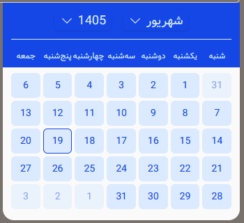
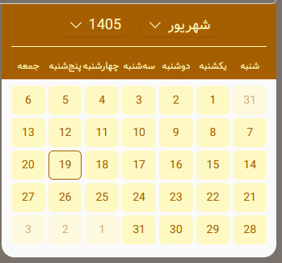
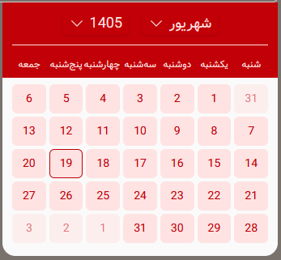

# Jalali Date Picker

A simple and customizable Jalali date picker for Laravel Livewire applications.

## About

Jalali Date Picker is a Livewire component for adding a Persian (Jalali) calendar and date picker to Laravel applications.

It is designed for Persian and RTL projects and provides an easy way to select, clear, and manage Jalali dates

## Screenshots

<div align="center">





</div>

## Features

- Jalali calendar
- Livewire 4 support
- Alpine.js powered interactions
- Tailwind CSS styling
- Responsive design
- RTL support
- Persian digit support
- Customizable calendar colors
- Minimum and maximum selectable dates


## Installation

Install the package via Composer:

```bash
composer require abolaradev/jalali-date-picker
```

Then Publish the package assets using:

```bash
php artisan vendor:publish --tag=jalali-date-picker-assets
```


# Usage

You can use the calendar component directly in your Livewire component:

```php
new class extends Component
{
   public $date;
};
```

```blade
<div>
   <livewire:jalali-date-picker::calendar wire:model="date" />
</div>
```


## Configuration

This calendar provides several options for customizing its behavior and appearance.

### Auto Close

The calendar will automatically close after selecting a date.

To change this behavior, simply set the `autoClose` Bounded Attribute:

```blade
<livewire:jalali-date-picker::calendar :autoClose="false" />
```

### Close On Outside Click

The calendar will automatically close when clicking outside the calendar area.

To change this behavior, simply set the `closeOnOutsideClick` Bounded Attribute:

```blade
<livewire:jalali-date-picker::calendar :closeOnOutsideClick="false" />
```

### Abbreviating Weekdays

By default, weekdays are displayed in abbreviated form on the calendar.

If you want to display the full weekday names, set the `abbreviatingWeekdays` Bounded Attribute:

```blade
<livewire:jalali-date-picker::calendar :abbreviatingWeekdays="false" />
```

### Persian Digits

By default, calendar numbers are displayed using English digits.

To display the numbers using Persian digits, set the `withPersianDigits` Bounded Attribute:

```blade
<livewire:jalali-date-picker::calendar :withPersianDigits="true" />
```

### Show Reset Date Button

By default, a Reset button is displayed after selecting a date from the calendar to allow the selected date to be cleared.

To change this behavior, set the `showResetDateButton` Bounded Attribute:

```blade
<livewire:jalali-date-picker::calendar :showResetDateButton="false" />
```

### Color

The calendar supports a variety of color themes.

You can set the `color` Livewire Component Attribute directly on the component.

This Attribute accepts Tailwind CSS color names such as `stone`, `amber`, `cyan`, `red`, and more.

> **Note:** Only use the Tailwind color name as the value.

```blade
<livewire:jalali-date-picker::calendar color="amber" />
```

### Minimum and Maximum Date

You can limit the range of selectable dates by setting the `minDate` and `maxDate` Attributes.

For example:

```blade
<livewire:jalali-date-picker::calendar
    minDate="1405/01/01"
    maxDate="1405/12/29"
/>
```


## Global Configuration

You can also define these settings globally for the Calendar Component.

To do this, simply publish the package configuration file:

```bash
php artisan vendor:publish --tag=jalali-date-picker-config
```

If you find this package useful, please don't forget to give it a ⭐ on GitHub. ❤️


## Changelog

Please see [CHANGELOG](CHANGELOG.md) for more information on what has changed recently.

## Contributing

Please see [CONTRIBUTING](CONTRIBUTING.md) for details.

## Security Vulnerabilities

Please review [our security policy](../../security/policy) for information on how to report security vulnerabilities.

## Credits

* [abolaradev](https://github.com/abolaradev)

* [All Contributors](../../contributors)

## License

The MIT License (MIT). Please see [License File](LICENSE.md) for more information.
